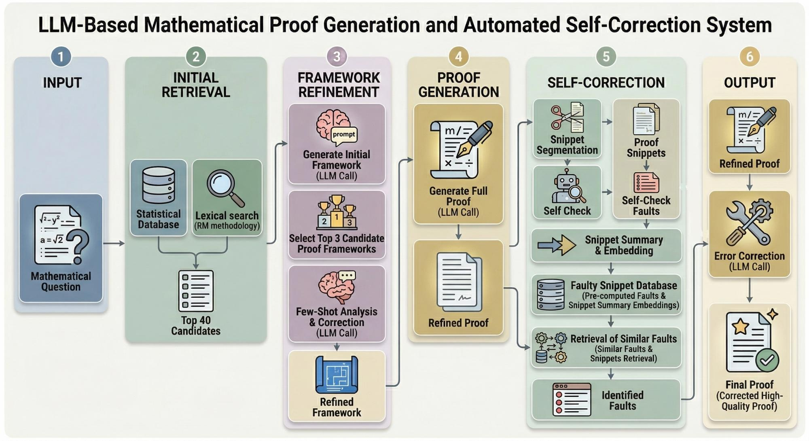

# [StatProver](https://statprover.com)

**An LLM-Based Automated Proof Generation and Self-Correction System for Rigorous Statistical Derivations**, by **[StatAI Lab](https://statai-lab.github.io/)**, School of Statistics and Data Science, Shanghai University of Finance and Economics

# Key Innovation: Two-Level Error Correction

| Level | Mechanism | What It Fixes |
|-------|-----------|---------------|
| **Macro** | Dynamic Framework Refinement | Early trajectory drift, flawed proof skeletons |
| **Micro** | Snippet-Level Self-Correction | Local logical leaps, attention decay over long chains |

# Core Technical Features

**1. Bi-directional Max-Matching Retrieval**

Instead of using global sentence embeddings (which suffer from semantic dilution), StatProver extracts dual-perspective keywords and uses asymmetric matching to find the most similar reference problems from a database of 40,366 statistical problems.

**2. LLM-as-a-Judge Framework Selection**

GPT-5.4 evaluates retrieved candidates not just by similarity, but by whether their actual proof structure provides actionable reference value for the current problem.

**3. Data-Driven Fault Repository**

By analyzing 80,000+ failure trajectories from LLM attempts on StatEval, we built an empirical fault repository. During inference, StatProver dynamically segments proofs, matches against historical faults, and executes targeted corrections.

# System Pipeline

# Key Contributions

- **Retrieval-Driven Proof Framework Refinement**: Bi-directional max-matching + LLM-as-Judge to dynamically refine initial drafts into logically robust macro-skeletons

- **Data-Driven Snippet-Level Self-Correction**: First-of-its-kind empirical fault repository enabling targeted rectification of micro-level logical leaps

- **Interactive Proof Assistant Platform**: Modular pipeline with Human-in-the-Loop workflow, publicly available at [statprover.com](https://statprover.com)

# Try It Out

**[Download Full Paper (PDF)](StatProver_Technical_Report.pdf)**

**[Official Website](https://statprover.com) : 3 free use per day!**

# Contact Us

- **[Prof. Fan Zhou](https://mlzxzhou.github.io/)**: zhoufan@mail.shufe.edu.cn
- **[StatAI Lab](https://statai-lab.github.io/)**: statai@163.com